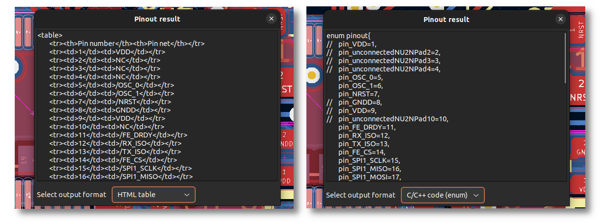
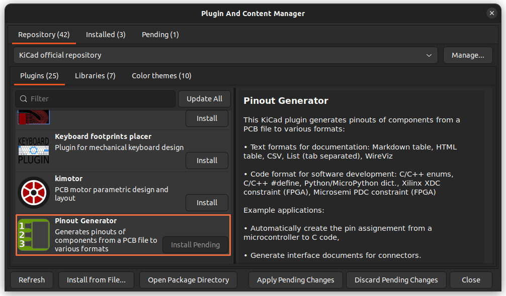

# KiCad Pinout Generator

**Compatibility:** KiCad 6.0, KiCad 7.0.

## Plugin presentation

This KiCad plugin generates pinouts of components from a PCB file to various formats:
* **Text** formats for documentation:
    * Markdown table
    * HTML table
    * CSV
    * List (tab separated)
    * [WireViz](https://github.com/formatc1702/WireViz)
* **Code** format for software development: 
    * C/C++ enums
    * C/C++ #define
    * Python/MicroPython dict.
    * Xilinx XDC constraint (FPGA)
    * Microsemi PDC constraint (FPGA)

Example applications:
* Automatically create the pin assignment from a microcontroller to C code,
* Generate interface documents for connectors.

*Example of a export as HTML (left) and C/C++ enum (right)*

## Install instructions

### Method A: Plugin and Content Manager (recommended)

The easiest way to install this plugin is to open KiCad's Plugin and Content Manager, look for "Pinout Generator" and press "Install"!

### Method B: Manual install (for development versions)

To install the plugin from GitHub:
1. Clone/download this repository and extract it to your KiCad plugin folder. You can find it by opening the PCB editor, and using "Tools" > "Externals Plugins" > "Open Plugin Directory".
2. Refresh the plugins by restarting the PCB editor or using "Tools" > "Externals Plugins" > "Refresh Plugins".

## Usage instructions

To use the plugin:
1. Select one component (or more),
2. Run the plugin by using the toolbar button or the Plugins menu,
3. Choose the desired format with the drop-down menu and copy-paste the result!

**This plugins only gives useful output if the pins have net names.** Use labels in the schematic editor to give the nets a human-readable name.

Note: in the generated code, both unconnected and power nets are ignored (commented in the output).

For C/C++ and Python format, there is a checkbox to use the pin name instead of pin number as the variable value. When checked, a filter can also be entered:
* If the filter is left empty, the full pin name is used.
* If something is entered, the plugin looks for this in the pin name, and extract the number after this string. For instance, if a pin name is "GPIO64/SPI", entering "GPIO" as filter will result in "64" in the output.

## License

This plugin is published under MIT license.
